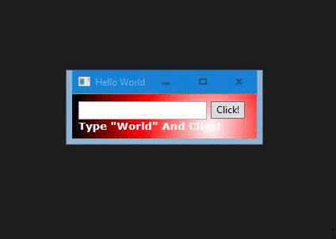

# Sciter + Rust Hello World

Read more about Sciter [here](https://sciter.com).  It's an alternative to Electron that's faster and smaller.  On the other hand, it uses its own versions of HTML, CSS, and JavaScript (TIScript).



## Instructions

```
cargo build --release
```

Download whichever "sciter.dll" file corresponds to your machine.  

On Windows 64bit for example, you'd download it from [this](https://github.com/c-smile/sciter-sdk/tree/master/bin.win/x64) folder.

Place "sciter.dll" in "target/release".

```
cargo run --release
```

